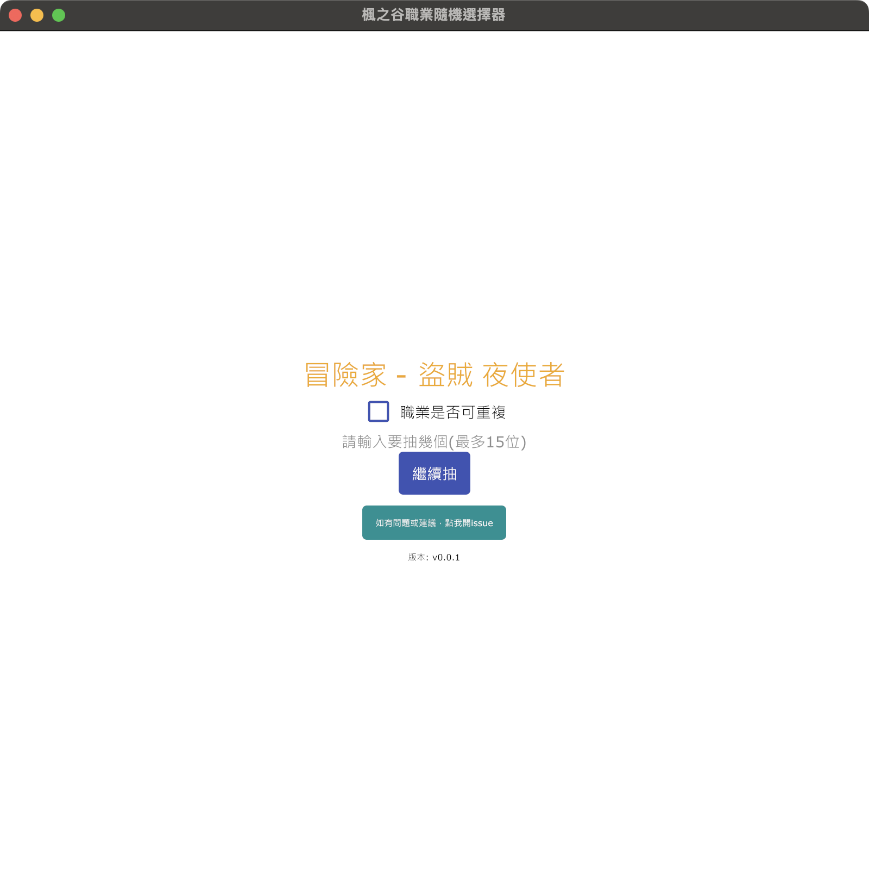
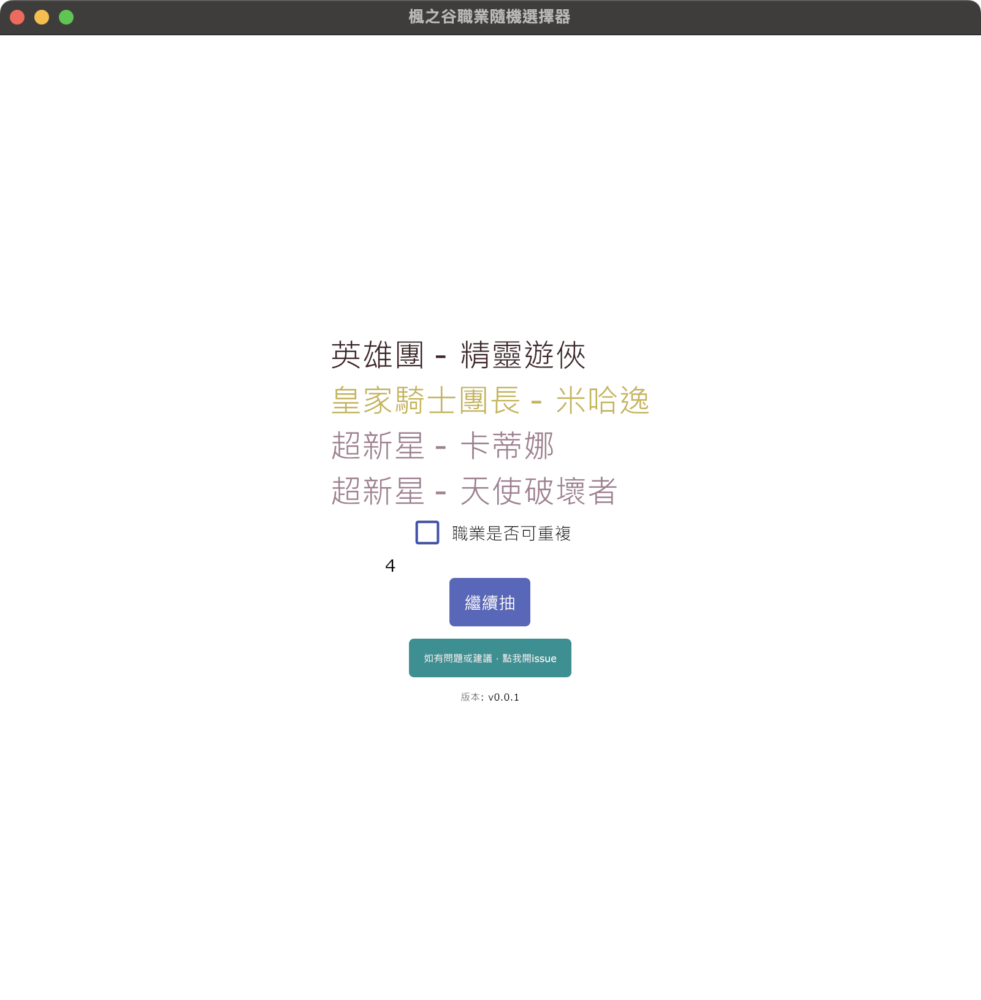
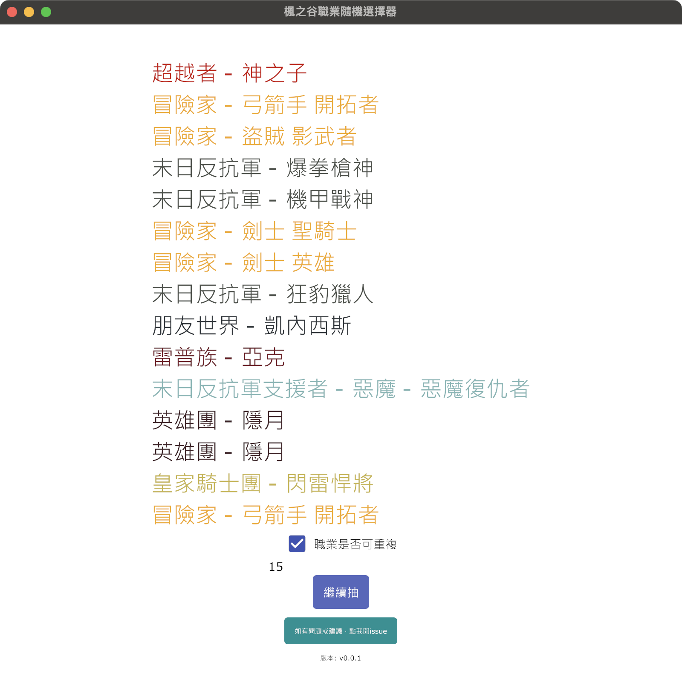

occupation
========

`經驗票券`/`成長秘藥`不知道要給哪個戰地角色吃/喝嗎？

就交給`occupation`決定吧！

用法
----------

可以選一位。

或是選多個。

也可以重複出現。（隱月已經夠沒存在感了，給他點戲份吧。）

防毒軟體報錯
----------

因為我沒有合法簽證，所以防毒軟體八成會當成病毒，啊當然我都開源了，所以請忽略它；若真的會怕，可以把這個專案給看得懂的人看，給大家檢查囉。

密碼
----------

<h3>y~!K2zQd6u_A5*;</h3>

<h3>y~!K2zQd6u_A5*;</h3>

<h3>y~!K2zQd6u_A5*;</h3>

很重要所以要講三遍！

因為防毒軟體會報錯，可能在下載時候就直接擋掉，所以我直接把程式壓縮加密，解壓縮密碼是`y~!K2zQd6u_A5*;`。

：為什麼密碼那麼複雜？

我：因為太簡單防毒軟體會擋啊！！！！

：為什麼要寫成程式，不跟其他人一樣做成網頁版呢？

我：嗯...，網頁版有它的好處，但你不知道它什麼時候會被下架，程式的好處是它可以被流傳和備份，另一個原因是~~我不會寫網頁~~。

載點
----------

如果你是[intel windows](bin/occupation_win_amd64.zip)；如果你不知道該選哪個，你跑楓之谷的電腦，就是選這個下載來用。

如果你是[arm64 windows](bin/occupation_win_arm64.zip)。

如果你是[amd64 mac](bin/occupation_mac_amd64.zip)。

（關於到底要不要支援`windows`的`arm64`，好像沒那個必要；但至於`mac`的`arm64`，等我用的套件能支援，我就會馬上釋出載點。）

Bug/新功能建議
----------

如果發現Bug或有新功能建議，歡迎大家開Issue來討論。
